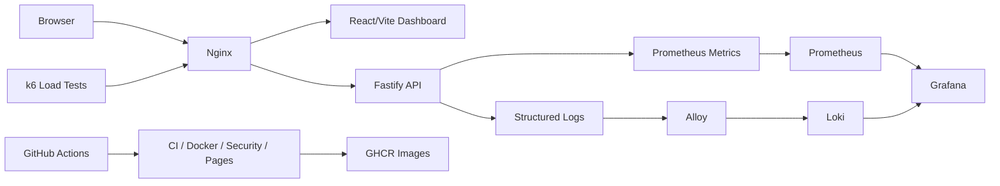

<div align="center">

# Production App Infrastructure

Production-style DevOps control center for a small API and dashboard with Docker, observability, CI/CD, security scans, rollback workflows, and Terraform validation.

[](https://itkrivoshei.github.io/production-app-infrastructure/)
[](https://github.com/itkrivoshei/production-app-infrastructure/actions/workflows/ci.yml)
[](https://github.com/itkrivoshei/production-app-infrastructure/actions/workflows/docker.yml)
[](https://github.com/itkrivoshei/production-app-infrastructure/actions/workflows/security.yml)
[](https://github.com/itkrivoshei/production-app-infrastructure/actions/workflows/codeql.yml)
[](https://github.com/itkrivoshei/production-app-infrastructure/actions/workflows/pages.yml)
[](LICENSE)

</div>

## Overview

This project demonstrates a production-oriented DevOps workflow around a containerized API, dashboard, observability stack, CI/CD automation, security checks, load testing, rollback workflows, and optional Terraform validation.

Core capabilities:

- Fastify API with health, readiness, OpenAPI, bounded metrics, graceful shutdown, and structured logs.
- React/Vite dashboard with action feedback, Activity Console events, and static preview guidance.
- Docker Compose stack with Prometheus, Grafana, Loki, Alloy, and k6.
- GitHub Actions for CI, GHCR image publishing, CodeQL, Trivy, Hadolint, and ShellCheck.
- Local rollback workflow with version and health verification.
- Optional Terraform AWS layer that boots the safe stack from digest-pinned GHCR images.
- Kubernetes handoff readiness checks.

## Architecture



## Tech Stack

| Area           | Tools                                               |
| -------------- | --------------------------------------------------- |
| API            | Fastify, TypeScript, OpenAPI, Prometheus metrics    |
| Web            | React, Vite, TypeScript, Nginx                      |
| Runtime        | Docker, Docker Compose, pnpm                        |
| Observability  | Prometheus, Grafana, Loki, Alloy                    |
| Load testing   | k6 smoke, load, and stress tests                    |
| CI/CD          | GitHub Actions, GHCR image publishing, GitHub Pages |
| Security       | CodeQL, Trivy, Hadolint, ShellCheck                 |
| Infrastructure | Terraform AWS validation layer                      |

## Safe Quick Start

The default Compose file exposes only the Nginx edge. It starts the API in
`APP_MODE=safe`, so `/load/*` and `/logs/generate` are not registered.

```bash
corepack enable
pnpm install
docker compose up --build -d
./scripts/healthcheck.sh
```

Open the safe local application:

| Service     | URL                                                                    |
| ----------- | ---------------------------------------------------------------------- |
| Dashboard   | [http://localhost:3000](http://localhost:3000)                         |
| API health  | [http://localhost:3000/api/health](http://localhost:3000/api/health)   |
| API docs    | [http://localhost:3000/api/docs](http://localhost:3000/api/docs)       |
| API metrics | [http://localhost:3000/api/metrics](http://localhost:3000/api/metrics) |

Stop the stack:

```bash
docker compose down
```

## Demo

### Online Preview

The online demo shows the DevOps Control Center interface with mock health, readiness, metrics, logs, and deployment data:

[Open the live demo](https://itkrivoshei.github.io/production-app-infrastructure/)

The online demo is a static UI preview. Demo actions update mock metrics and the Activity Console, while local-only services such as Grafana, Prometheus, Loki, and API docs open guidance panels instead of broken local URLs. The full observability stack runs locally with Docker Compose.

### Full Local Demo

Run the real stack locally:

```bash
export COMPOSE_FILE=docker-compose.yml:docker-compose.demo.yml
docker compose --profile observability up --build -d
pnpm demo:health
```

Services:

| Service    | URL                                                                    |
| ---------- | ---------------------------------------------------------------------- |
| Dashboard  | [http://localhost:3000](http://localhost:3000)                         |
| API docs   | [http://localhost:3000/api/docs](http://localhost:3000/api/docs)       |
| Prometheus | [http://localhost:9090](http://localhost:9090)                         |
| Grafana    | [http://localhost:3001](http://localhost:3001)                         |
| Loki       | [http://localhost:3100](http://localhost:3100)                         |

The dashboard port can still be overridden:

```bash
NGINX_PORT=8088 docker compose --profile observability up --build -d
```

Demo scenarios:

```bash
pnpm demo:health
pnpm k6:docker:load
curl -i -X POST http://localhost:3000/api/load/errors \
  -H "X-Demo-Action: true"
./scripts/restart.sh api
./scripts/rollback-demo.sh
./scripts/rollback-demo.sh --clean
```

The dashboard can also generate CPU load, controlled errors, and logs from the UI.

Stop the demo stack:

```bash
docker compose --profile observability down
```

### Screenshots

#### Product

| Screenshot | What it shows |
| --- | --- |
|  | Dashboard: healthy API, ready status, version, uptime, requests, and error rate |
|  | Activity Console after generating load, errors, and logs |
|  | Dashboard at a mobile viewport |
|  | Dashboard's own Metrics page |
|  | Metrics page at a narrower desktop viewport |
|  | Swagger/OpenAPI UI listing all API endpoints |
|  | GitHub Pages static preview guidance panel |

#### Observability

| Screenshot | What it shows |
| --- | --- |
|  | Prometheus scrape target `UP` |
|  | Prometheus graph of request rate across API routes |
|  | Grafana dashboard during a k6 load run |

#### Reliability & Testing

| Screenshot | What it shows |
| --- | --- |
|  | Terminal output of `pnpm k6:docker:load` |
|  | k6 load test results summary |
|  | Full observability stack starting cleanly |
|  | Every service passing `pnpm demo:health` |
|  | Rollback simulation with real source refs and a healthy rollback target |

More detail on each capture is in [docs/screenshots](docs/screenshots/README.md).

See the [Demo guide](docs/demo.md) for the step-by-step walkthrough.

## Local Quality Gate

```bash
pnpm run ci
pnpm docs:consistency
pnpm observability:validate
pnpm e2e:pages
RUN_BROWSER_E2E=true pnpm integration:compose
./scripts/rollback-demo.sh --dry-run
PREVIOUS_REF=HEAD^ ./scripts/rollback-demo.sh --dry-run
./scripts/rollback-demo.sh HEAD^
./scripts/rollback-demo.sh --clean
```

Terraform validation:

```bash
cd infra/terraform/aws
terraform init
terraform fmt -check -recursive
terraform validate
cd ../../..
```

## Commands

| Command                | Purpose                                   |
| ---------------------- | ----------------------------------------- |
| `pnpm dev:local`       | Start the local development workflow      |
| `pnpm docker:dev`      | Start the Docker development stack        |
| `pnpm docker:down`     | Stop the Docker stack                     |
| `pnpm demo:up`         | Start the demo environment                |
| `pnpm demo:down`       | Stop the demo environment                 |
| `pnpm demo:health`     | Run demo health checks                    |
| `pnpm demo:load`       | Generate demo load                        |
| `pnpm demo:rollback`   | Run the rollback demo                     |
| `pnpm docs:links`      | Validate relative Markdown documentation links |
| `pnpm docs:consistency` | Validate documented runtime invariants          |
| `pnpm health`          | Run health checks                         |
| `pnpm readiness`       | Run Kubernetes readiness checks           |
| `pnpm kubernetes:readiness` | Run Kubernetes readiness checks directly |
| `pnpm logs`            | Show service logs                         |
| `pnpm k6:docker:smoke` | Run k6 smoke tests in Docker              |
| `pnpm k6:docker:load`  | Run k6 load tests in Docker               |
| `pnpm tf:aws:fmt`      | Check Terraform formatting                |
| `pnpm tf:aws:validate` | Validate the optional AWS Terraform layer |

Direct API checks:

```bash
curl -fsS http://localhost:3000/api/health
curl -fsS http://localhost:3000/api/ready
curl -fsS http://localhost:3000/api/version
curl -fsS http://localhost:3000/api/metrics | head
```

Generate traffic and logs:

```bash
curl -fsS -X POST http://localhost:3000/api/load/cpu \
  -H "Content-Type: application/json" \
  -H "X-Demo-Action: true" \
  -d '{"durationMs":500}'

curl -fsS -X POST http://localhost:3000/api/logs/generate \
  -H "Content-Type: application/json" \
  -H "X-Demo-Action: true" \
  -d '{"level":"info","message":"manual demo log"}'
```

## Documentation

| Topic                | Link                                                       |
| -------------------- | ---------------------------------------------------------- |
| Architecture         | [docs/architecture.md](docs/architecture.md)               |
| Demo guide           | [docs/demo.md](docs/demo.md)                               |
| Local development    | [docs/local-development.md](docs/local-development.md)     |
| Monitoring           | [docs/monitoring.md](docs/monitoring.md)                   |
| Logging              | [docs/logging.md](docs/logging.md)                         |
| Load testing         | [docs/load-testing.md](docs/load-testing.md)               |
| CI/CD                | [docs/ci-cd.md](docs/ci-cd.md)                             |
| Security             | [docs/security.md](docs/security.md)                       |
| Rollback             | [docs/rollback.md](docs/rollback.md)                       |
| Terraform AWS        | [docs/terraform-aws.md](docs/terraform-aws.md)             |
| Kubernetes readiness | [docs/kubernetes-readiness.md](docs/kubernetes-readiness.md) |
| Troubleshooting      | [docs/troubleshooting.md](docs/troubleshooting.md)         |

## Kubernetes Handoff

Run this before starting Kubernetes work. The readiness command reuses an
already running full demo stack:

```bash
export COMPOSE_FILE=docker-compose.yml:docker-compose.demo.yml
docker compose --profile observability up --build -d
./scripts/kubernetes-readiness.sh
```

For a one-shot check that starts and then stops the stack automatically:

```bash
START_STACK=true ./scripts/kubernetes-readiness.sh
```

Add `CHECK_GHCR=true` after the main-branch Docker workflow publishes images
to require the expected packages to be reachable.

## License

[MIT](LICENSE)
