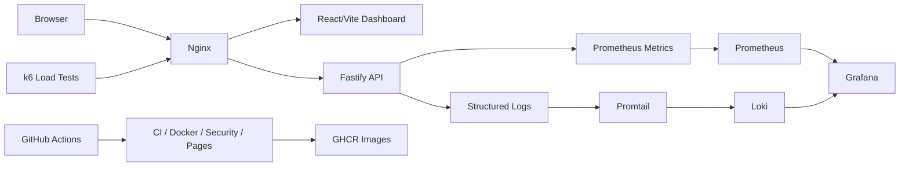

<div align="center">

# Production App Infrastructure

Production-style DevOps control center for a small API and dashboard with Docker, observability, CI/CD, security scans, rollback workflows, and Terraform validation.

[](https://itkrivoshei.github.io/production-app-infrastructure/)
[](https://github.com/itkrivoshei/production-app-infrastructure/actions/workflows/ci.yml)
[](https://github.com/itkrivoshei/production-app-infrastructure/actions/workflows/docker.yml)
[](https://github.com/itkrivoshei/production-app-infrastructure/actions/workflows/security.yml)
[](https://github.com/itkrivoshei/production-app-infrastructure/actions/workflows/codeql.yml)
[](https://github.com/itkrivoshei/production-app-infrastructure/actions/workflows/pages.yml)
[](LICENSE)

</div>

## Overview

This project demonstrates a production-oriented DevOps workflow around a containerized API, dashboard, observability stack, CI/CD automation, security checks, load testing, rollback workflows, and optional Terraform validation.

Core capabilities:

- Fastify API with health, readiness, OpenAPI, metrics, demo load, and structured logs.
- React/Vite dashboard with action feedback, Activity Console events, and static preview guidance.
- Docker Compose stack with Prometheus, Grafana, Loki, Promtail, and k6.
- GitHub Actions for CI, GHCR image publishing, CodeQL, Trivy, Hadolint, and ShellCheck.
- Local rollback workflow with version and health verification.
- Optional Terraform AWS validation layer.
- Kubernetes handoff readiness checks.

## Architecture



## Tech Stack

| Area           | Tools                                               |
| -------------- | --------------------------------------------------- |
| API            | Fastify, TypeScript, OpenAPI, Prometheus metrics    |
| Web            | React, Vite, TypeScript, Nginx                      |
| Runtime        | Docker, Docker Compose, pnpm                        |
| Observability  | Prometheus, Grafana, Loki, Promtail                 |
| Load testing   | k6 smoke, load, and stress tests                    |
| CI/CD          | GitHub Actions, GHCR image publishing, GitHub Pages |
| Security       | CodeQL, Trivy, Hadolint, ShellCheck                 |
| Infrastructure | Terraform AWS validation layer                      |

## Quick Start

```bash
corepack enable
pnpm install
docker compose up --build -d
./scripts/healthcheck.sh
```

Open the local demo:

| Service     | URL                                                            |
| ----------- | -------------------------------------------------------------- |
| Dashboard   | [http://localhost:3000](http://localhost:3000)                 |
| API         | [http://localhost:8080](http://localhost:8080)                 |
| API health  | [http://localhost:8080/health](http://localhost:8080/health)   |
| API docs    | [http://localhost:8080/docs](http://localhost:8080/docs)       |
| API metrics | [http://localhost:8080/metrics](http://localhost:8080/metrics) |
| Prometheus  | [http://localhost:9090](http://localhost:9090)                 |
| Grafana     | [http://localhost:3001](http://localhost:3001)                 |
| Loki        | [http://localhost:3100](http://localhost:3100)                 |
| Promtail    | [http://localhost:9080](http://localhost:9080)                 |

Stop the stack:

```bash
docker compose down
```

## Demo

### Online Preview

The online demo shows the DevOps Control Center interface with mock health, readiness, metrics, logs, and deployment data:

[Open the live demo](https://itkrivoshei.github.io/production-app-infrastructure/)

The online demo is a static UI preview. Demo actions update mock metrics and the Activity Console, while local-only services such as Grafana, Prometheus, Loki, and API docs open guidance panels instead of broken local URLs. The full observability stack runs locally with Docker Compose.

### Full Local Demo

Run the real stack locally:

```bash
docker compose up --build
```

Services:

| Service    | URL                                                      |
| ---------- | -------------------------------------------------------- |
| Dashboard  | [http://localhost:3000](http://localhost:3000)           |
| API        | [http://localhost:8080](http://localhost:8080)           |
| API docs   | [http://localhost:8080/docs](http://localhost:8080/docs) |
| Prometheus | [http://localhost:9090](http://localhost:9090)           |
| Grafana    | [http://localhost:3001](http://localhost:3001)           |
| Loki       | [http://localhost:3100](http://localhost:3100)           |

The dashboard port can still be overridden:

```bash
NGINX_PORT=8088 docker compose up --build
```

Demo scenarios:

```bash
pnpm demo:health
pnpm k6:docker:load
curl -i -X POST http://localhost:8080/load/errors
./scripts/restart.sh api
./scripts/rollback-demo.sh v1.0.0
./scripts/rollback-demo.sh --clean
```

The dashboard can also generate CPU load, controlled errors, and logs from the UI.

See the [Demo guide](docs/demo.md) for the step-by-step walkthrough.

## Local Quality Gate

```bash
pnpm run ci
docker compose config
docker compose up --build -d
./scripts/healthcheck.sh
./scripts/kubernetes-readiness.sh
pnpm k6:docker:smoke
pnpm k6:docker:load
./scripts/rollback-demo.sh v1.0.0
./scripts/rollback-demo.sh --clean
```

Terraform validation:

```bash
cd infra/terraform/aws
terraform init
terraform fmt -check -recursive
terraform validate
cd ../../..
```

## Commands

| Command                | Purpose                                   |
| ---------------------- | ----------------------------------------- |
| `pnpm dev:local`       | Start the local development workflow      |
| `pnpm docker:dev`      | Start the Docker development stack        |
| `pnpm docker:down`     | Stop the Docker stack                     |
| `pnpm demo:up`         | Start the demo environment                |
| `pnpm demo:down`       | Stop the demo environment                 |
| `pnpm demo:health`     | Run demo health checks                    |
| `pnpm demo:load`       | Generate demo load                        |
| `pnpm demo:rollback`   | Run the rollback demo                     |
| `pnpm docs:links`      | Validate relative Markdown documentation links |
| `pnpm health`          | Run health checks                         |
| `pnpm readiness`       | Run Kubernetes readiness checks           |
| `pnpm kubernetes:readiness` | Run Kubernetes readiness checks directly |
| `pnpm logs`            | Show service logs                         |
| `pnpm k6:docker:smoke` | Run k6 smoke tests in Docker              |
| `pnpm k6:docker:load`  | Run k6 load tests in Docker               |
| `pnpm tf:aws:fmt`      | Check Terraform formatting                |
| `pnpm tf:aws:validate` | Validate the optional AWS Terraform layer |

Direct API checks:

```bash
curl -fsS http://localhost:8080/health
curl -fsS http://localhost:8080/ready
curl -fsS http://localhost:8080/version
curl -fsS http://localhost:8080/metrics | head
```

Generate traffic and logs:

```bash
curl -fsS -X POST http://localhost:8080/load/cpu \
  -H "Content-Type: application/json" \
  -d '{"durationMs":500}'

curl -fsS -X POST http://localhost:8080/logs/generate \
  -H "Content-Type: application/json" \
  -d '{"level":"info","message":"manual demo log"}'
```

## Documentation

| Topic                | Link                                                       |
| -------------------- | ---------------------------------------------------------- |
| Architecture         | [docs/architecture.md](docs/architecture.md)               |
| Demo guide           | [docs/demo.md](docs/demo.md)                               |
| Local development    | [docs/local-development.md](docs/local-development.md)     |
| Monitoring           | [docs/monitoring.md](docs/monitoring.md)                   |
| Logging              | [docs/logging.md](docs/logging.md)                         |
| Load testing         | [docs/load-testing.md](docs/load-testing.md)               |
| CI/CD                | [docs/ci-cd.md](docs/ci-cd.md)                             |
| Security             | [docs/security.md](docs/security.md)                       |
| Rollback             | [docs/rollback.md](docs/rollback.md)                       |
| Terraform AWS        | [docs/terraform-aws.md](docs/terraform-aws.md)             |
| Kubernetes readiness | [docs/kubernetes-readiness.md](docs/kubernetes-readiness.md) |
| Troubleshooting      | [docs/troubleshooting.md](docs/troubleshooting.md)         |

## Kubernetes Handoff

Run this before starting Kubernetes work:

```bash
./scripts/kubernetes-readiness.sh
```

For strict GHCR validation after the main-branch Docker workflow publishes images:

```bash
CHECK_GHCR=true ./scripts/kubernetes-readiness.sh
```

## License

[MIT](LICENSE)
