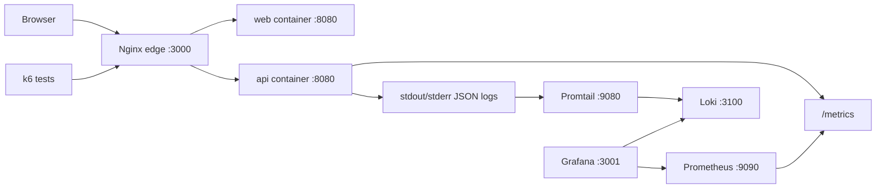

# Architecture

## Overview

This project runs a small production-style local stack behind an Nginx edge container.

Nginx is the public local entrypoint. It serves the dashboard and proxies API traffic, while Prometheus, Grafana, Loki, Promtail, and k6 provide local observability and reliability testing.

## Local Stack

## Request Flow

| Flow                       | Description                                                             |
| -------------------------- | ----------------------------------------------------------------------- |
| Browser -> Nginx -> web    | Serves the React/Vite dashboard through the local Nginx edge.           |
| Browser -> Nginx -> API    | Proxies `/api/*` requests to the Fastify API container.                 |
| Prometheus -> API          | Scrapes application metrics from the API metrics endpoint.              |
| API -> stdout/stderr       | Emits structured JSON logs for container log collection.                |
| Promtail -> Loki           | Discovers Docker containers and ships logs to Loki.                     |
| Grafana -> Prometheus/Loki | Reads metrics and logs through provisioned datasources.                 |
| k6 -> Nginx                | Runs smoke, load, and stress tests against the public local entrypoint. |

## Services

| Service      | Purpose                                                                                  |
| ------------ | ---------------------------------------------------------------------------------------- |
| `api`        | Fastify API with health, readiness, OpenAPI, metrics, demo load, and demo log endpoints. |
| `web`        | React dashboard built by Vite and served by unprivileged Nginx.                          |
| `nginx`      | Public local entrypoint and reverse proxy for dashboard and API traffic.                 |
| `prometheus` | Scrapes API metrics and stores local time-series data.                                   |
| `grafana`    | Provides provisioned dashboards and datasources for metrics and logs.                    |
| `loki`       | Stores local log streams collected from Docker containers.                               |
| `promtail`   | Discovers Docker containers and ships structured logs to Loki.                           |
| `k6`         | Optional Compose profile for smoke, load, and stress testing.                            |

## Runtime Decisions

- API and web images use multi-stage Docker builds.
- Runtime containers use non-root users where practical.
- Nginx is the only public local entrypoint for browser traffic.
- Frontend API calls use relative paths so the same build works behind Nginx.
- Application configuration is environment-based.
- Logs go to `stdout` and `stderr` so Docker, Promtail, and future Kubernetes logging can collect them.
- Compose healthchecks mirror endpoints that Kubernetes probes can reuse later.
- Observability is local-first and runs through Docker Compose without external services.

## Routing Model

| Route      | Target                                        |
| ---------- | --------------------------------------------- |
| `/`        | Dashboard served through Nginx                |
| `/api/*`   | API traffic proxied through Nginx             |
| `/metrics` | API metrics endpoint scraped by Prometheus    |
| `/docs`    | API documentation served by the API container |

For local service URLs and commands, see the root [README](../README.md).

## Kubernetes Handoff

The local stack is designed so core runtime concepts can map cleanly to a future Kubernetes setup.

| Local Compose Concept    | Kubernetes Equivalent                |
| ------------------------ | ------------------------------------ |
| Compose healthchecks     | Liveness and readiness probes        |
| Environment variables    | ConfigMaps and Secrets               |
| Nginx edge               | Ingress or gateway layer             |
| Docker logs              | Cluster log collection               |
| Prometheus scrape target | ServiceMonitor or scrape config      |
| Container images         | Registry-published deployment images |
| Rollback demo tags       | Deployment image rollback            |
