# Demo Screenshots

This folder stores visual proof for the local demo and project documentation.

Screenshots should show the full DevOps workflow: dashboard status, action feedback, static guidance, observability, logs, load testing, and rollback behavior.

## Capturing Screenshots

Start the full local stack:

```bash
export COMPOSE_FILE=docker-compose.yml:docker-compose.demo.yml
docker compose --profile observability up --build -d
pnpm demo:health
```

Generate traffic before capturing observability screens:

```bash
pnpm k6:docker:load
```

Generate demo logs before capturing Loki/Grafana Explore:

```bash
curl -fsS -X POST http://localhost:3000/api/logs/generate \
  -H "Content-Type: application/json" \
  -H "X-Demo-Action: true" \
  -d '{"level":"info","message":"screenshot demo log"}'
```

The dashboard can also be captured headlessly instead of a manual browser screenshot:

```bash
chromium --headless --disable-gpu --window-size=1440,1100 \
  --screenshot=docs/screenshots/dashboard.png \
  http://localhost:3000
```

Stop the local stack when done:

```bash
docker compose down
```

## Screenshots

| Screenshot | Description |
| --- | --- |
| 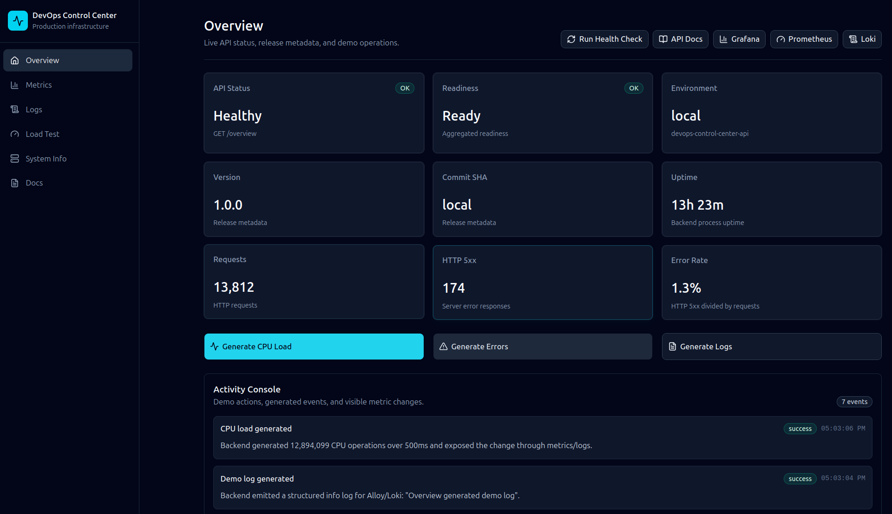 | **[`dashboard.png`](dashboard.png)** — Dashboard at `http://localhost:3000` showing healthy API, ready status, version, commit, uptime, requests, errors, and error rate. |
| 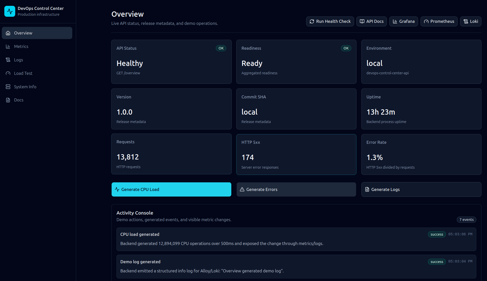 | **[`activity-console.png`](activity-console.png)** — Dashboard after running load/error/log actions, showing timestamped Activity Console entries. |
| 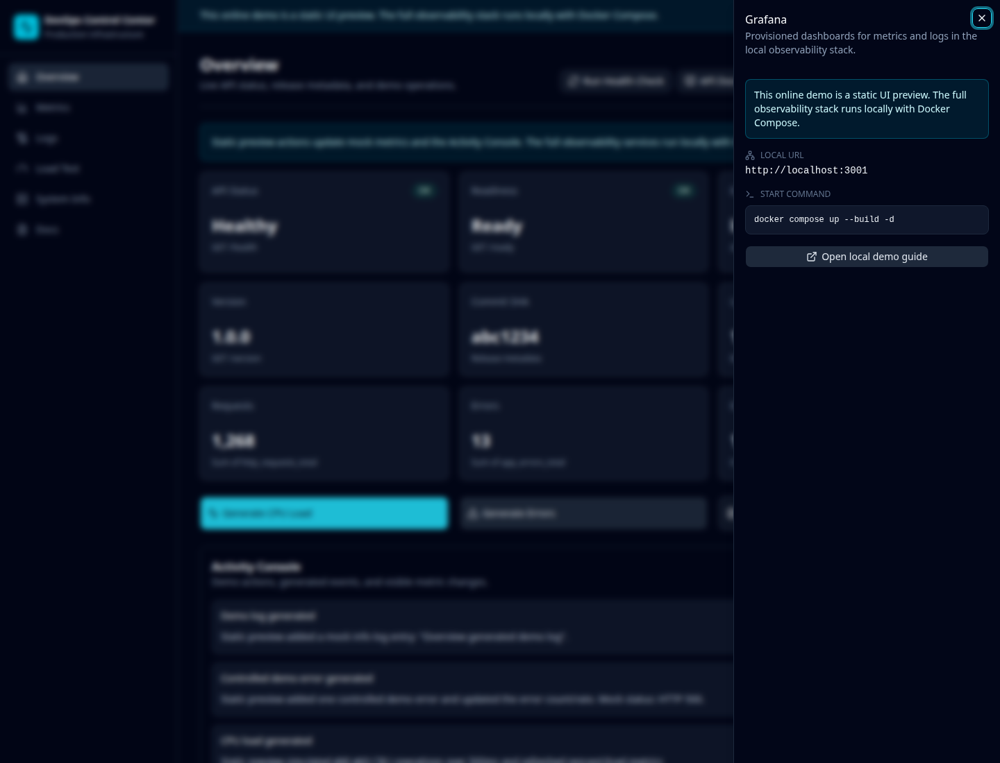 | **[`static-guidance.png`](static-guidance.png)** — GitHub Pages static preview with a local-only service guidance panel open. |
| 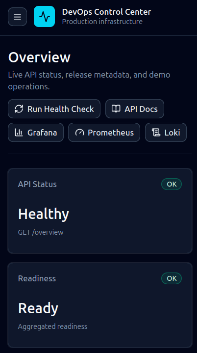 | **[`mobile-dashboard.png`](mobile-dashboard.png)** — Dashboard static preview or local dashboard at a mobile viewport with controls readable and not overlapping. |
| 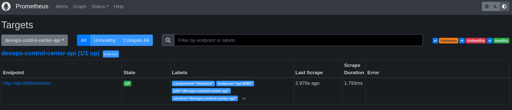 | **[`prometheus-targets.png`](prometheus-targets.png)** — Prometheus **Status → Targets** page showing the `devops-control-center-api` scrape target as `UP`. |
| 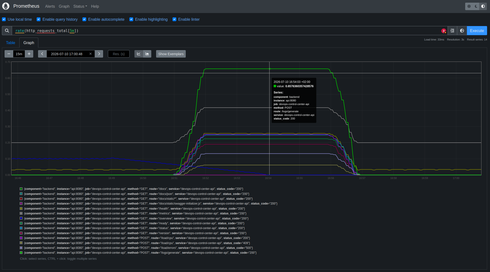 | **[`prometheus-graph-requests.png`](prometheus-graph-requests.png)** — Prometheus Graph tab plotting `rate(http_requests_total[5m])` across routes after a k6 load run. |
| 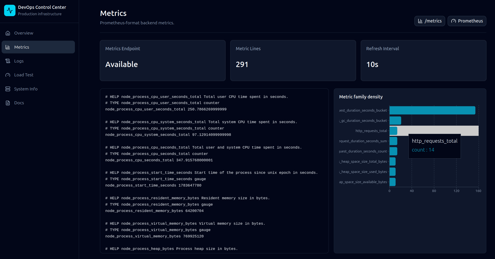 | **[`dashboard-metrics.png`](dashboard-metrics.png)** — Dashboard **Metrics** page showing raw Prometheus-format output and the metric family density chart. |
| 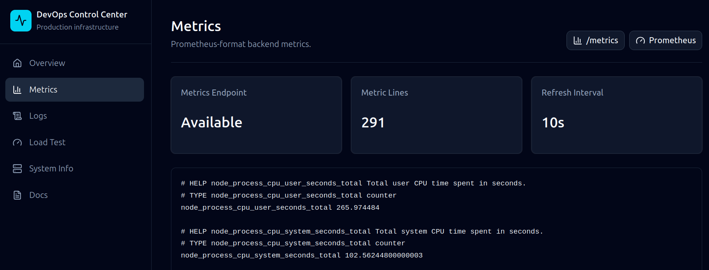 | **[`dashboard-metrics-narrow.png`](dashboard-metrics-narrow.png)** — Dashboard **Metrics** page at a narrower desktop viewport with summary cards and raw metric output visible. |
| 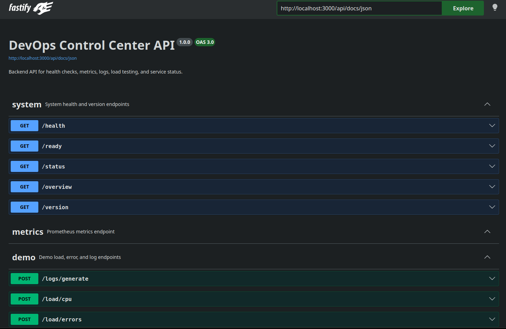 | **[`api-docs.png`](api-docs.png)** — Swagger/OpenAPI UI at `/api/docs` listing the system, metrics, and demo endpoint groups. |
| 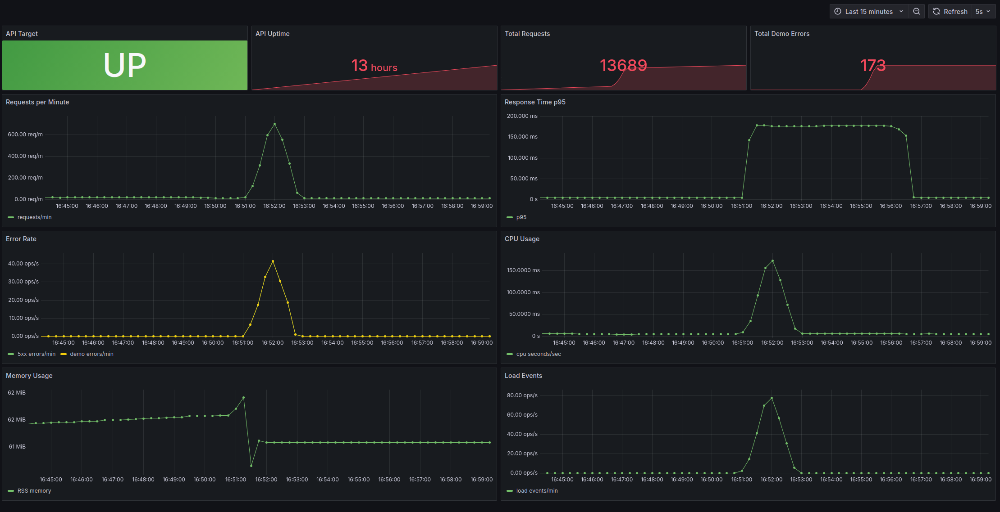 | **[`grafana-dashboard-load.png`](grafana-dashboard-load.png)** — Grafana dashboard after running `pnpm k6:docker:load`, showing request rate, latency, error rate, CPU, memory, and load-event panels. |
| 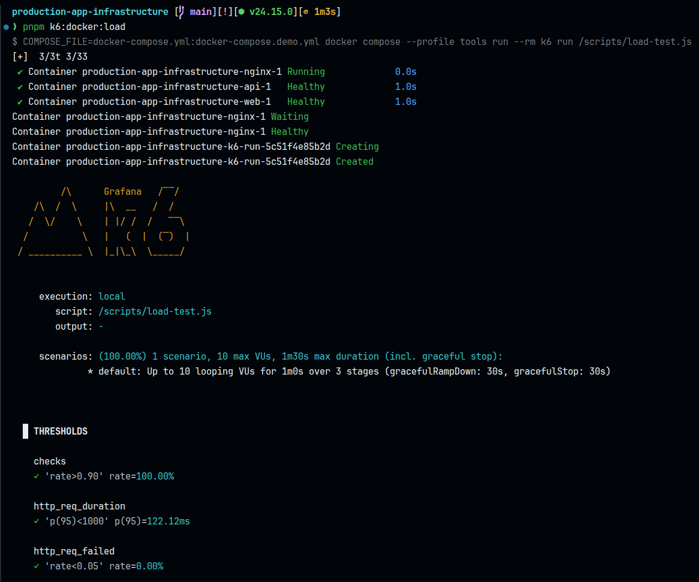 | **[`k6-load-terminal.png`](k6-load-terminal.png)** — Terminal output from `pnpm k6:docker:load` showing container startup and the k6 run starting. |
| 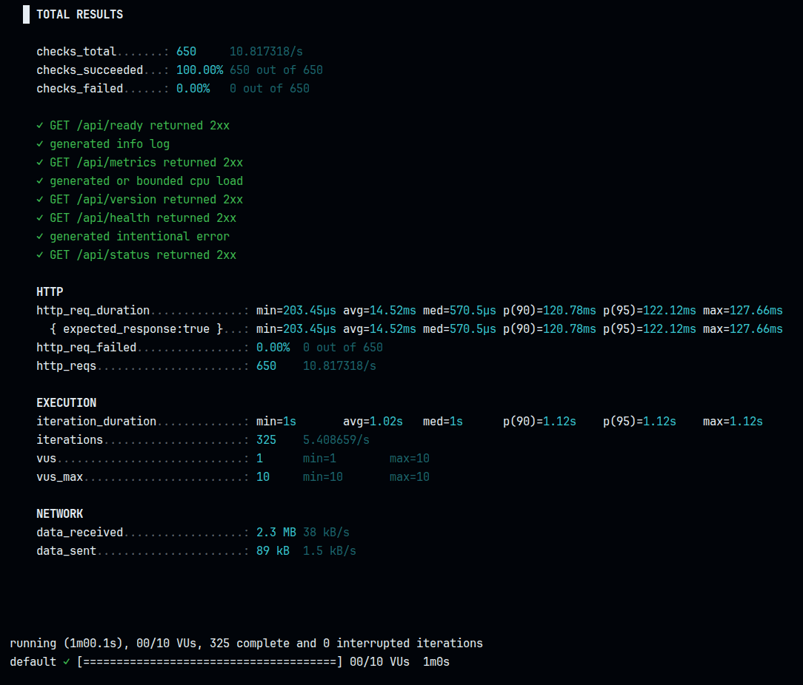 | **[`k6-load-summary.png`](k6-load-summary.png)** — k6 `TOTAL RESULTS` summary panel (checks, HTTP stats, thresholds) from a completed load run. |
| 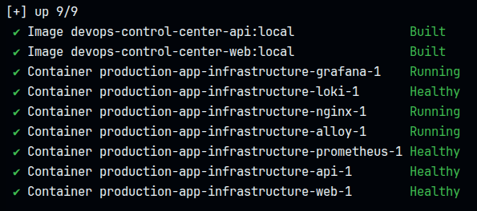 | **[`docker-compose-up-full-stack.png`](docker-compose-up-full-stack.png)** — Terminal output from bringing up the full stack with `--profile observability`, showing all 9 containers built and healthy. |
| 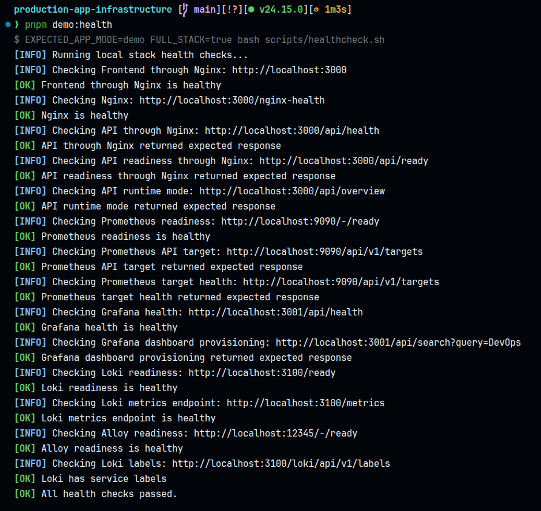 | **[`demo-health-terminal.png`](demo-health-terminal.png)** — Terminal output from `pnpm demo:health` showing every service (Nginx, API, Prometheus, Grafana, Loki, Alloy) passing its health check. |
| 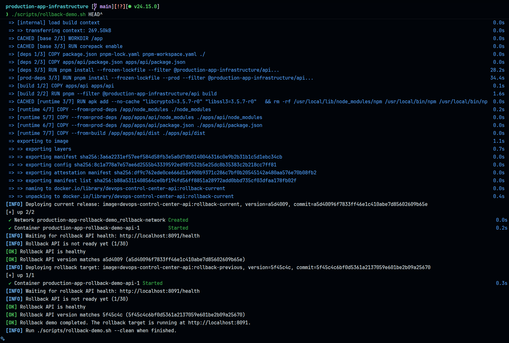 | **[`rollback-demo-terminal.png`](rollback-demo-terminal.png)** — Terminal output from [`./scripts/rollback-demo.sh`](../../scripts/rollback-demo.sh) `HEAD^` showing the real source refs, derived versions, and a healthy rollback target. |

## Still Needed

Grafana Explore showing Loki logs.

## Standards

| Setting        | Recommendation                                                                        |
| -------------- | ------------------------------------------------------------------------------------- |
| Resolution     | `1440x1100` or similar desktop viewport                                               |
| Theme          | Default project theme / dark Grafana theme                                            |
| Browser chrome | Hide if possible for clean documentation screenshots                                  |
| Terminal font  | Use a readable monospace font                                                         |
| Content        | Show successful health, metrics, logs, or rollback output clearly                     |
| Secrets        | Do not include tokens, credentials, `.env` values, cloud account IDs, or private URLs |

## Safety

Before committing screenshots:

- Check that no secrets, credentials, local `.env` values, or cloud identifiers are visible.
- Prefer local demo data over real production data.
- Keep image names stable so README and documentation links do not break.
- Compress large screenshots if they become unnecessarily heavy.
