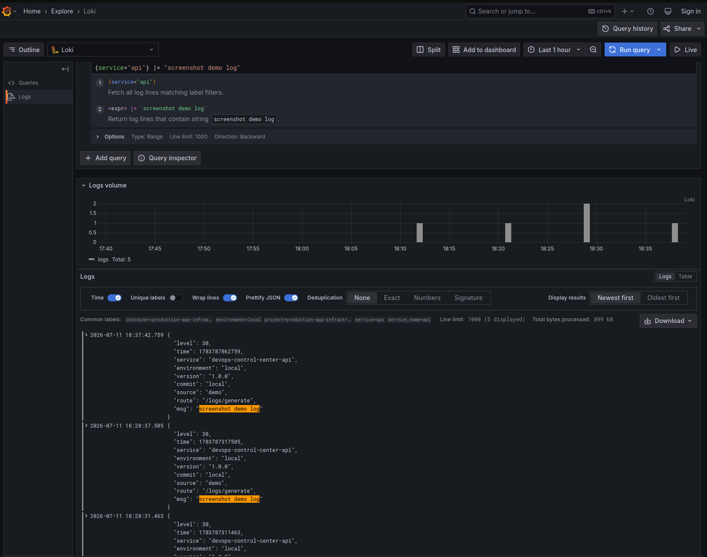

# Demo Screenshots

This folder stores visual proof for the local DevOps Control Center demo: the dashboard, observability stack, load testing flow, health checks, and rollback workflow.

## Product UI

| Screenshot | What it shows |
| --- | --- |
|  | **[`dashboard.png`](dashboard.png)** — Healthy API, ready status, version, commit, uptime, requests, errors, and error rate. |
|  | **[`activity-console.png`](activity-console.png)** — Timestamped feedback after running load, error, and log actions. |
|  | **[`mobile-dashboard.png`](mobile-dashboard.png)** — Dashboard controls at a mobile viewport. |
|  | **[`dashboard-metrics.png`](dashboard-metrics.png)** — Raw Prometheus-format output and metric family density. |
|  | **[`dashboard-metrics-narrow.png`](dashboard-metrics-narrow.png)** — Metrics page at a narrower desktop viewport. |
|  | **[`api-docs.png`](api-docs.png)** — Swagger/OpenAPI UI for system, metrics, and demo endpoints. |
|  | **[`static-guidance.png`](static-guidance.png)** — Static preview guidance for local-only services. |

## Observability

| Screenshot | What it shows |
| --- | --- |
|  | **[`prometheus-targets.png`](prometheus-targets.png)** — API scrape target marked `UP`. |
|  | **[`prometheus-graph-requests.png`](prometheus-graph-requests.png)** — Request-rate query across API routes after load generation. |
|  | **[`grafana-dashboard-load.png`](grafana-dashboard-load.png)** — Request rate, latency, error rate, CPU, memory, and load-event panels. |
|  | **[`grafana-explore-loki-logs.png`](grafana-explore-loki-logs.png)** — Loki logs in Grafana Explore filtered to the generated demo log. |

## Reliability & Testing

| Screenshot | What it shows |
| --- | --- |
|  | **[`k6-load-terminal.png`](k6-load-terminal.png)** — `pnpm k6:docker:load` starting the containerized load run. |
|  | **[`k6-load-summary.png`](k6-load-summary.png)** — Completed k6 checks, HTTP stats, and thresholds. |
|  | **[`docker-compose-up-full-stack.png`](docker-compose-up-full-stack.png)** — Full local stack starting with observability services. |
|  | **[`demo-health-terminal.png`](demo-health-terminal.png)** — Nginx, API, Prometheus, Grafana, Loki, and Alloy passing health checks. |
|  | **[`rollback-demo-terminal.png`](rollback-demo-terminal.png)** — Rollback simulation with source refs, derived versions, and a healthy target. |
